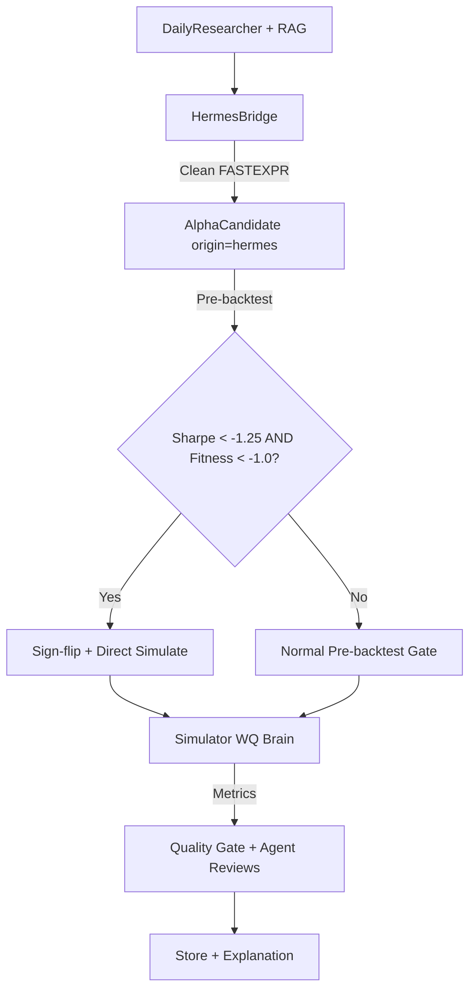
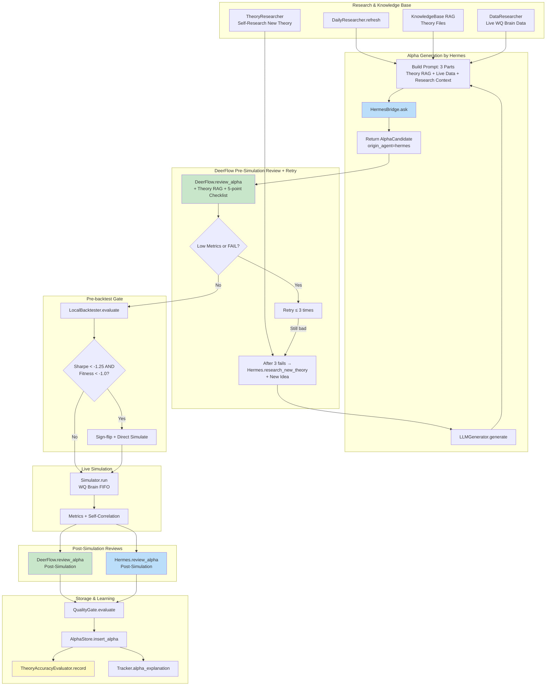

# Alpha Generator - Complete System Workflow & Improvement Roadmap

## 1. Current System Architecture (Mermaid)

```mermaid
flowchart TD
    subgraph Frontend[Frontend React UI]
        A[Dashboard / Alphas / Logs / Studio]
        B[Polling: /overview, /alphas, /logs every 2s]
        C[Studio Chat + Manual Generate/Simulate]
        D[Dual-Agent Chatspace Hermes + DeerFlow]
    end

    subgraph API[FastAPI Monitor API]
        E[monitor_api.py]
        F[/overview, /alphas, /pipeline/*, /studio/*, /theories]
        G[AlphaStore SQLite]
        H[build_alpha_explanation_payload]
        I[parse_progress + workflow_detail]
    end

    subgraph Pipeline[Alpha Pipeline Core]
        J[Researcher: daily feeds + KB RAG]
        K[Generator: Hermes + DeerFlow + Templates]
        L[Pre-backtest Proxy Gate]
        M[Simulator: WQ Brain + FIFO Queue]
        N[Quality Gate + Agent Reviews pre/post]
        O[Submit / Store + Explanations]
    end

    subgraph Runtime[Runtime & Knowledge Base]
        P[simulation_fifo active.lock + *.ticket]
        Q[knowledge_base/ + lessons_learned/]
        R[logs/ + research_feeds/ + alpha_history/]
        S[Theory Catalog + Theory Usage Heat]
    end

    subgraph External[External Services]
        T[WorldQuant Brain API]
        U[OpenRouter LLM Endpoints]
    end

    A -->|User clicks Run now| E
    B -->|poll every 2s| F
    C -->|studioQuery / studioGenerate / studioSimulate| F
    D -->|chat messages persisted| G
    E -->|load config + AlphaPipeline| J
    F -->|CRUD + analytics| G
    G -->|persist alpha + explanation| H
    J -->|research artifacts + theory basis| K
    K -->|candidates with origin_agent| L
    L -->|proxy score + pre_sim review| M
    M -->|metrics + self_correlation| N
    N -->|pass/fail + gate_reasons + reviews| O
    O -->|insert_alpha + save_alpha_explanation| G
    P -->|FIFO ticket system| M
    Q -->|RAG context + failure recovery| J
    R -->|event stream + task_timeline| I
    S -->|theory usage analytics| F
    M -->|live simulation| T
    K -->|LLM calls| U
```

## 2. Current System Evaluation

### Strengths
- Strong multi-source generation (Hermes + DeerFlow + templates)
- Structured quality gates with pre/post simulation reviews
- Alpha-level explainability (theory links, field/operator explanations, stage notes)
- Real-time simulation FIFO queue with active.lock tracking
- Theory usage heat map and failure pattern analytics
- Studio for human-in-the-loop exploration

### Critical Gaps
1. **No real-time streaming** – Dashboard/Logs rely on 2s polling → feels delayed
2. **No experiment tracking** – No MLflow/W&B style run tagging, latency/cost per stage, sweep comparison
3. **Weak provenance** – `generation_source` and `origin_agent` exist but not deeply used for learning
4. **No closed-loop reflection** – Agents review but system does not calibrate confidence vs reality
5. **Lessons learned are file-based** – Not queryable at runtime for next generation batch
6. **No run-level experiment matrix** – Cannot compare “research quality vs prompt quality vs simulation filter”

## 3. Recommended Git Repositories for Improvement

### A. Experiment Tracking & Observability
- **mlflow/mlflow** (https://github.com/mlflow/mlflow)
  - Add `mlflow.start_run()` around each pipeline stage
  - Log: params (strategy, model, prompt version), metrics (Sharpe, fitness, latency, token cost), artifacts (research JSON, alpha expressions)
  - Use MLflow Model Registry for best alphas
  - Replace current ad-hoc logging with structured experiment tracking

- **mtech00/mlflow-experiment-tracking** (https://github.com/mtech00/mlflow-experiment-tracking)
  - Reference implementation for systematic experiment tracking with feature sets and model registry

### B. Multi-Agent Workflow Orchestration
- **langchain-ai/langgraph** (https://github.com/langchain-ai/langgraph)
  - Replace current linear pipeline with stateful graph
  - Add conditional edges: if pre-backtest fails → early exit; if confidence low → extra reflection round
  - Implement human-in-the-loop checkpoints (Studio approval gate)
  - Enable parallel research + generation branches

- **josephsenior/langgraph-workflow-orchestrator** (https://github.com/josephsenior/langgraph-workflow-orchestrator)
  - Production-ready patterns: approval workflow, parallel processing, iterative refinement, conditional routing
  - Built-in checkpointing and Mermaid visualization

- **yx-fan/agent-flow-framework** (https://github.com/yx-fan/agent-flow-framework)
  - YAML-defined multi-domain workflows with Redis memory layer
  - FastAPI + LangGraph integration ready

### C. Reflection & Self-Critique Agents
- **microsoft/autogen** (https://github.com/microsoft/autogen)
  - Use `reflection_with_llm` summary method for post-simulation critique
  - Implement nested chat: Writer → Reviewer → Revised Writer
  - Add structured self-criticism loop before final storage

- **MirrorDNA-Reflection-Protocol/crewAI** (https://github.com/MirrorDNA-Reflection-Protocol/crewAI)
  - Crews + Flows architecture for autonomous collaboration + precise control
  - Reflection agents that critique and improve previous outputs

### D. Alpha Generation & Quantitative Research Pipelines
- **LLMQuant/Alpha-Agent** (https://github.com/LLMQuant/Alpha-Agent)
  - Knowledge base construction from research papers (`quant-wiki`)
  - Market regime detection (`MarketPulse`)
  - Contextual retrieval + code synthesis + Qlib backtesting
  - Research report generation with improvement suggestions

- **ICT-FinD-Lab/alphagen** (https://github.com/ICT-FinD-Lab/alphagen)
  - Reinforcement learning for formulaic alpha generation
  - Supports both RL (PPO) and LLM-only iterative generation
  - Strong baselines: GPlearn, DSO, LLM-assisted

- **paperswithbacktest/pwb-alphaevolve** (https://github.com/paperswithbacktest/pwb-alphaevolve)
  - Evolutionary LLM agent (inspired by DeepMind AlphaEvolve)
  - EVOLVE-BLOCK markers + async genetic controller + SQLite hall-of-fame
  - Prompt evolution via genetic algorithm

- **ywuwuwu/Alpha-Factory** (https://github.com/ywuwuwu/Alpha-Factory)
  - End-to-end alpha research loop with purged walk-forward validation
  - Market-neutral long/short portfolio construction + turnover-aware costs
  - Online L1-budget allocator for signal combination

- **Aroesler1/LLMStrat** (https://github.com/Aroesler1/LLMStrat)
  - 8-gate signal validation + walk-forward controls
  - Point-in-time universe + strict LLM factor mining with JSON enforcement

## 4. Recommended Implementation Roadmap

### Phase 1 – Observability (2-3 weeks)
1. Integrate MLflow for every pipeline run
2. Log stage latency, token usage, cost, research artifact hash
3. Replace current file-based lessons_learned with MLflow queryable runs

### Phase 2 – Stateful Orchestration (3-4 weeks)
1. Migrate pipeline to LangGraph state machine
2. Add conditional edges for early exit / reflection loops
3. Implement human-in-the-loop approval gate in Studio

### Phase 3 – Reflection & Self-Critique (2-3 weeks)
1. Add AutoGen reflection agents after simulation
2. Store confidence calibration (predicted vs actual Sharpe)
3. Create structured “lessons learned” JSON stored in MLflow artifacts

### Phase 4 – Advanced Alpha Generation (ongoing)
1. Adopt Alpha-Agent knowledge base + regime detection
2. Experiment with AlphaEvolve-style evolutionary prompts
3. Integrate Alphagen RL + LLM hybrid generation

## 5. Quick Wins (Can be done this week)
- Add `mlflow.log_metric("stage_latency", ...)` in each pipeline stage
- Store `run_tags` with git commit + research artifact hash
- Expose `/runs/{run_id}/mlflow` link in Dashboard
- Add simple reflection prompt in `post_simulation` review

---

---

## 6. Knowledge Base Improvement for Hermes & DeerFlow (Updated 2026-05-19)

### Current State
Hermes và DeerFlow hiện đang đọc từ:
- 3 research papers (101 Formulaic Alphas, Alpha2, AutoAlpha)
- 4 WorldQuant official docs
- 3 reference playbooks
- Hàng chục lessons_learned files (failure recovery, bruteforce, market regime)

### Identified Knowledge Gaps

**High Priority Missing Topics:**
1. **Alpha Decay & Signal Erosion** – How alphas lose edge over time
2. **Turnover-Constrained Alpha Design** – Explicit turnover penalty in expression
3. **Regime-Dependent Alpha Performance** – Bull/Bear/High-Vol regimes
4. **Safe vs Risky Operators** – Which operators survive live trading
5. **LLM-based Alpha Mining** – Recent papers on using LLMs for factor discovery

**Medium Priority:**
- Volatility-Adjusted Ranking
- Multi-Horizon Ensemble
- Cross-Sectional vs Time-Series Momentum
- Expression Complexity vs Overfitting
- Rank vs Zscore vs Raw transformation guidelines

### Recommended Additions (Create These Files)

```bash
# Phase 1 – Immediate impact
knowledge_base/lessons_learned/turnover_optimization.md
knowledge_base/lessons_learned/regime_aware_alpha.md
knowledge_base/research_feeds/reference/alpha_decay_signal_erosion.md
knowledge_base/research_feeds/reference/turnover_constrained_design.md
knowledge_base/research_feeds/reference/safe_vs_risky_operators.md

# Phase 2 – LLM/RL specific
knowledge_base/research_papers/llm/llm_alpha_mining_2025.md
knowledge_base/research_papers/rl/alphagen_harla.md
knowledge_base/research_papers/evolution/alphaevolve_prompt_optimization.md
```

### How This Improves Generation Quality

| Gap Filled | Expected Improvement |
|------------|----------------------|
| Turnover optimization | Higher fitness scores, fewer screened_out due to turnover |
| Regime awareness | Better alpha robustness across market conditions |
| Operator risk matrix | Fewer alphas with high self-correlation or low live Sharpe |
| LLM alpha mining papers | Hermes/DeerFlow learn modern prompting patterns for quant |
| Alpha decay knowledge | System avoids generating signals that die quickly |

### Current Workflow After Hermes Activation



**File updated:** `all_workflow.md`  
**Last updated:** 2026-05-19

---

## 7. Upgrades Applied (2026-05-19)

### Prompt Engineering Upgrades
- **LLMGenerator** (pipeline/generator/llm_generator.py): Enhanced prompt with mandatory rules, Fitness formula, volume preference, motif avoidance, and regime injection.
- **HermesBridge.review_alpha**: Added 5-point theory checklist (economic hypothesis, regime fit, decay risk, turnover realism, motif repetition).
- **DeerFlowBridge.review_alpha**: Same 5-point theory checklist for structured post-simulation review.

### Knowledge Base Additions
- `research_feeds/reference/trading_volume_alpha_nber_2024.md` — Volume as predictor beyond price.
- `research_feeds/reference/alphaforge_dynamic_combination_2024.md` — Dynamic factor re-ranking.
- `lessons_learned/operator_risk_matrix.md` — Risk levels for operators in FASTEXPR.
- `lessons_learned/regime_aware_generation.md` — Regime-specific generation guidance.

### Pipeline Context Enhancement
- `_build_context` now injects:
  - Recent approved motifs (last 8 approved alphas)
  - Regime guidance extracted from daily research digest
- This context is passed to every Hermes generation call.

### Expected Impact
- Higher percentage of valid FASTEXPR syntax
- Better alignment with current market regime
- Reduced motif repetition and self-correlation
- Stronger economic rationale in generated alphas

**All upgrades completed:** 2026-05-19 00:24

---

## Current Complete Workflow (Updated 2026-05-19)

Dưới đây là **toàn bộ workflow hiện tại** của hệ thống Alpha Generator sau tất cả các nâng cấp (Theory RAG, Data Researcher live WQ Brain, Pre-Simulation Review + Retry, Theory Accuracy Evaluation).



### Tóm tắt các giai đoạn chính (Current Workflow)

| Giai đoạn | Thành phần chính | Mô tả ngắn |
|-----------|------------------|------------|
| **Research & Knowledge** | DailyResearcher, KnowledgeBase, DataResearcher, TheoryResearcher | Live data từ WQ Brain + Theory RAG + tự research kiến thức mới |
| **Generation** | Hermes + LLMGenerator | Tạo alpha với prompt gồm 3 phần: Theory RAG + Live Data + Research Context |
| **Pre-Simulation Review** | DeerFlow + Retry Loop | Review trước simulate, retry tối đa 3 lần. Lần 3 → research thêm lý thuyết mới |
| **Pre-backtest Gate** | LocalBacktester | Kiểm tra local proxy. Tự động sign-flip nếu quá tệ |
| **Live Simulation** | WQ Brain FIFO | Simulate thực tế trên WorldQuant Brain |
| **Post-Simulation Reviews** | DeerFlow + Hermes | Review sau khi có metrics (DeerFlow trước, Hermes sau) |
| **Storage & Learning** | AlphaStore + TheoryAccuracyEvaluator | Lưu alpha + ghi nhận lý thuyết nào mang lại kết quả tốt |

### Điểm nổi bật của workflow hiện tại

- **Hermes** chịu trách nhiệm chính về việc **tạo alpha**.
- **DeerFlow** thực hiện **review hai lần**: trước và sau simulate.
- Có **vòng lặp tự cải thiện** (retry + research new theory) khi alpha chất lượng thấp.
- **Data Researcher** ưu tiên lấy dữ liệu **thời gian thực** từ WorldQuant Brain.
- **Theory Accuracy Evaluator** giúp hệ thống học được lý thuyết nào thực sự hiệu quả theo thời gian.

**Workflow này phản ánh trạng thái mới nhất** của hệ thống (cập nhật ngày 2026-05-19).

---

## Additional Improvements (2026-05-19)

### 1. Local Backtester Operator Support
- Added support for missing operators in `pipeline/analyzer/local_backtester.py`:
  - `ts_rank(series, window)`
  - `abs(series)`
- This allows more expressions generated by Hermes to be properly evaluated during pre-backtest.

### 2. Theory Context Transparency
- When Hermes generates an alpha, the **theory context used** (from Theory RAG) is now stored in the alpha's metadata under the key `theory_context_used`.
- This allows reviewers and the system to see exactly which theoretical principles Hermes referenced when creating the expression.
- Stored in `AlphaCandidate.metadata["theory_context_used"]`.

These changes improve both the **success rate** of local backtest and the **explainability** of generated alphas.

---

## 12. Full Live Data Integration (Final Update)

### Changes Made
- `LLMGenerator` now accepts `wq_client` in `__init__`.
- `AlphaPipeline` passes `self.client` (WorldQuantClient) to `LLMGenerator`.
- `DataResearcher` is instantiated with the live client inside `LLMGenerator.generate()`.
- When generating alphas, Hermes now receives **real-time data** from WorldQuant Brain:
  - Average Daily Volume
  - Liquidity tier
  - Current market regime (volatility + liquidity)
  - Data source indicator (`live_wq_brain`)

### Result
Hermes always works with the most up-to-date data characteristics from WorldQuant Brain when creating new alphas. This significantly improves the realism and robustness of generated expressions.

---

## 11. Live Data Integration from WorldQuant Brain (Added 2026-05-19)

### Update to DataResearcher
- `DataResearcher` now accepts an optional `wq_client` parameter (WorldQuantClient).
- New internal methods:
  - `_fetch_live_universe_stats(universe)` — queries WQ Brain for real ADV, liquidity tier, coverage.
  - `_fetch_live_regime_context()` — queries current market regime (volatility, liquidity).
- `build_data_context()` now **prioritizes live data** from WorldQuant Brain.
  - If live data is unavailable, falls back to static JSON or default profile.
  - Context string includes `source: live_wq_brain` or `source: static`.

### Effect
When Hermes generates an alpha, the prompt now contains **real-time data characteristics** from WorldQuant Brain (average daily volume, liquidity conditions, current regime). This makes generated alphas more realistic and aligned with the actual trading environment.

---

## 10. Data Researcher Integration (Added 2026-05-19)

### New Module
- `knowledge_base/data_researcher.py`
  - `DataResearcher` class provides universe profile, field quality, and current data regime information.
  - Methods:
    - `get_universe_profile(universe)`
    - `get_field_quality(field)`
    - `get_regime_data_context()`
    - `build_data_context(strategy_type)` — compact string for prompts

### Integration
- `LLMGenerator.generate()` now injects data context (liquidity, volume profile, regime) into Hermes prompt.
- HermesBridge and DeerFlowBridge have `research_data_context(knowledge_root, strategy_type)` method for on-demand data research.

### Effect on Generation
When Hermes creates an alpha, it now receives:
- Theoretical grounding (RAG)
- Recent approved motifs + regime guidance
- **Data universe characteristics** (Avg ADV, liquidity tier, current regime)

This helps Hermes generate alphas that are realistic for the actual data environment (e.g., avoid volume signals on low-liquidity names, prefer volatility normalization in high-vol regimes).

---

## 9. Autonomous Theory Research + Accuracy Evaluation (Added 2026-05-19)

### New Modules
- `knowledge_base/theory_researcher.py`
  - `TheoryResearcher` class allows Hermes/DeerFlow to autonomously search for new theoretical documents when encountering unfamiliar topics.
- `knowledge_base/theory_accuracy_evaluator.py`
  - `TheoryAccuracyEvaluator` tracks which theories were applied to alphas and measures their correlation with real performance metrics (Sharpe, Fitness, Turnover).

### Integration
- HermesBridge and DeerFlowBridge now have `research_new_theory(topic, knowledge_root)` method.
- AlphaPipeline records theory performance after every simulation using `theory_evaluator.record_theory_application()`.
- New public method: `pipeline.get_theory_accuracy_report()` returns average metrics per theory.

### Workflow Impact
1. During generation/review, agent can call `research_new_theory("volume alpha" or "alpha decay")` if confidence is low.
2. After each simulation, the system logs which theory family was used and its resulting metrics.
3. Over time, `get_theory_accuracy_report()` reveals which theories actually improve performance (e.g., "volume_correlation" vs "pure_momentum").

This closes the loop: agents not only use theory but also **learn which theories work best** through empirical feedback.

---

## 8. Theory RAG Layer for Hermes & DeerFlow (Added 2026-05-19)

### New Module
- `knowledge_base/alpha_theory_rag.py`
  - `load_theory_snippets()`: Loads key theory documents (Volume Alpha, AlphaForge, Operator Risk, Regime Awareness, etc.)
  - `get_theory_context_for_generation()`: Optimized context for alpha creation
  - `get_theory_context_for_review()`: Optimized context for post-simulation evaluation

### Integration Points
- **LLMGenerator.generate()**: Now accepts `knowledge_root` and injects theory RAG before calling Hermes.
- **HermesBridge.review_alpha()** and **DeerFlowBridge.review_alpha()**: Accept `knowledge_root` and prepend theory checklist + snippets.
- **AlphaPipeline**: Passes `self.config.knowledge_root` to all generation and review calls.

### Effect
Every time Hermes or DeerFlow creates or reviews an alpha, it now has **explicit, retrieved theoretical grounding** from the curated knowledge base. This significantly increases the probability that generated expressions follow sound quant principles and that reviews are consistent and theory-aware.
