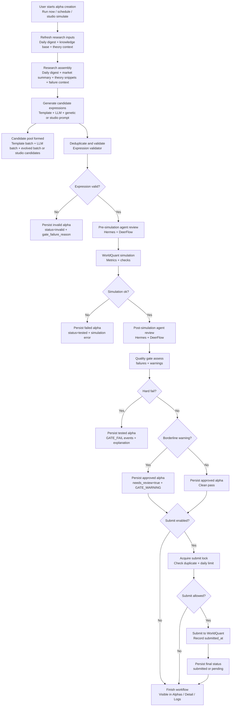

# All Workflows

## Purpose

This file is the single review surface for the current `Alpha_Generator` system.
It captures:
- the end-to-end product workflows,
- the frontend and backend operating model,
- the current agent and explainability flows,
- the current validation status, safeguards, and remaining gaps.

Last updated: `2026-05-18`

## 1. Platform Workflow

### 1.1 Monitor UI

- User opens `http://127.0.0.1:8506`
- `FastAPI` serves both the React build and `/api/*` endpoints
- Old Streamlit paths under `/_stcore/*` are redirected back to `/` with `301`
- SPA responses for `index.html` include:
  - `Clear-Site-Data: "cache", "storage"`
  - `Cache-Control: no-store`

### 1.2 React routes

- `/`
- `/alphas`
- `/alphas/:id`
- `/research`
- `/logs`
- `/settings`
- `/theories`
- `/studio`

### 1.3 UI operating surfaces

- Dashboard:
  - run controls,
  - live stage cards,
  - progress meter,
  - alerts,
  - histogram,
  - best alpha summary
- Alphas:
  - filterable table,
  - similarity matrix,
  - warning badge for borderline pass cases
- Alpha Detail:
  - rationale and hypothesis,
  - evidence basis,
  - theory basis,
  - implementation logic,
  - risk notes,
  - gate failure banner when present
- Settings:
  - masked credentials,
  - reveal/hide controls,
  - dirty-field save,
  - WorldQuant connection test
- Studio:
  - workflow tracker,
  - agent responses,
  - chatspace history,
  - candidate pool,
  - direct simulation into alpha detail

## 2. API Workflow

### 2.1 Entrypoints

- UI backend entrypoint: `api_layer/monitor_api.py`
- Runtime entrypoint: `python main.py --serve-ui --host 127.0.0.1 --port 8506`

### 2.2 Main API surfaces

- `GET /api/health`
- `GET /api/options`
- `GET /api/overview`
- `GET /api/pipeline/runs`
- `GET /api/pipeline/runs/{run_id}/events`
- `GET /api/pipeline/runs/{run_id}/research`
- `GET /api/alphas`
- `GET /api/alphas/{alpha_id}`
- `GET /api/research`
- `GET /api/logs`
- `GET /api/settings`
- `POST /api/settings`
- `POST /api/settings/test`
- `POST /api/actions/run`
- `POST /api/actions/stop`
- `GET /api/theories`
- `POST /api/theories`
- `POST /api/studio/context`
- `POST /api/studio/query`
- `POST /api/studio/generate`
- `POST /api/studio/simulate`

### 2.3 Non-API compatibility routes

- `GET /_stcore/{path:path}` → redirect to `/`

## 3. Alpha Research Workflow

### 3.0 End-to-end create-alpha flow

Short read:
1. Alpha creation can start from scheduled pipeline, manual `Run now`, brute-force mode, or Studio simulation.
2. Every candidate goes through validation, agent review, simulation, quality gate, explanation persistence, and optional submission.
3. Failed, warning, approved, and submitted states all end up visible through the same monitor surfaces: `Dashboard`, `Alphas`, `Alpha Detail`, and `Logs`.

### 3.0.1 Research phase detail

The create-alpha flow does not start from prompting an agent blindly. It first assembles a research package from multiple layers:

1. `DailyResearcher.refresh()` updates the daily research digest.
2. `knowledge_base.load_all()` refreshes the local document and theory context.
3. `_research_market(strategy_type)` builds a market-facing summary:
   - if routing prefers DeerFlow, DeerFlow produces a research summary for the current strategy type,
   - otherwise the system uses WorldQuant leaderboard snapshots plus discovered paper sources.
4. `_build_context(...)` merges:
   - alpha context for the selected strategy,
   - market research summary,
   - daily digest,
   - theory context,
   - failure-pattern context from prior runs.
5. `WorkflowTracker.research_artifact(...)` persists the main research outputs into `research_artifacts`.

In practice, this means the generator receives a context bundle made of:
- what recently worked,
- what recently failed,
- theory snippets mapped to alpha design,
- strategy-specific market summary,
- daily research notes.

### 3.0.2 Generate phase detail

After research is assembled, the system creates candidate expressions through more than one source so it does not depend on a single generation style.

Standard pipeline generation path:

1. `TemplateEngine.generate(...)`
   - emits deterministic template-based expressions,
   - gives stable baseline motifs,
   - reduces risk of an empty run.
2. `LLMGenerator.generate(...)`
   - calls Hermes with the assembled research context,
   - generates strategy-aware FASTEXPR candidates,
   - benefits from theory and failure-memory context.
3. `GeneticEngine.evolve(...)`
   - takes template + LLM seeds,
   - mutates and recombines them,
   - adds exploration beyond the first-pass prompts.
4. `_deduplicate(...)`
   - removes exact duplicate expressions before simulation.
5. Candidate count is trimmed to the requested target batch.

Studio generation path:

1. User refreshes a context bundle from `/api/studio/context`.
2. User either:
   - sends a direct prompt to Hermes, DeerFlow, or both through `/api/studio/query`, or
   - runs `/api/studio/generate` with objective-driven prompt construction.
3. `extract_expressions(...)` scans agent responses for FASTEXPR-like lines.
4. `mergeCandidates(...)` keeps only unique expressions inside the current studio pool.

So the generate stage can produce candidates from four practical origins:
- template generation,
- LLM generation,
- genetic evolution,
- direct studio/agent conversation.

### 3.0.3 Research-to-generate handoff

This handoff is the core quality lever in the system:

- Research answers: "What should we try and what should we avoid?"
- Generation answers: "Given that context, what expressions can we actually test?"

Concrete handoff artifacts:
- `daily_digest`
- `market_summary`
- strategy-specific context text
- theory snippets
- failure context

Those artifacts are then visible again later through:
- `Research` page,
- `Alpha Detail`,
- `pipeline_events`,
- `research_artifacts`.

### 3.1 Standard pipeline

1. Refresh daily research and local knowledge base
2. Build alpha context, theory context, and failure context
3. Generate template, LLM, and evolved alpha candidates
4. Deduplicate and validate expressions
5. Run Hermes and DeerFlow pre-simulation review
6. Simulate through the WorldQuant adapter
7. Run Hermes and DeerFlow post-simulation review
8. Assess quality gate with structured failures and warnings
9. Persist alpha rows, workflow events, research artifacts, and explanations
10. Submit only if enabled, passing, and not blocked by idempotency checks

### 3.2 Brute-force workflow

1. Build brute-force candidate grid by family and lookback
2. Simulate candidates one by one
3. Assess gate failures and warnings the same way as the standard pipeline
4. Persist metrics, pipeline events, and explanations
5. Group winners and losers by family
6. Feed learning notes back into the knowledge base
7. Keep `--no-submit` on when the goal is agent learning rather than production submission

### 3.3 Failure recovery workflow

1. Detect validation failure, simulation failure, or gate failure
2. Pull more market context through the daily researcher
3. Read at least one paper or paper excerpt
4. Save a recovery note into `knowledge_base/lessons_learned/failure_recovery`
5. Ask Hermes for a remediation candidate
6. Requeue the recovery candidate if it is valid and not already seen

## 4. Quality Gate Workflow

### 4.1 Assessment model

`pipeline/submission/quality_gate.py` now returns:
- `failures`: hard stops
- `warnings`: borderline pass signals

Structured failure payload shape includes:
- `reason`
- `message`
- `field`
- `value`
- `threshold`

### 4.2 Gate outcomes

- Hard fail:
  - alpha status becomes `tested` or `invalid`
  - `gate_failure_reason` is stored on `alpha_runs`
  - `GATE_FAIL` event is persisted into `pipeline_events`
- Borderline pass:
  - alpha can still be `approved` or `submitted`
  - `needs_review=True` is stored on `alpha_runs`
  - `GATE_WARNING` event is persisted into `pipeline_events`
  - UI shows `Warning` badge

### 4.3 User-facing explainability

- Alphas table surfaces warning state and latest gate note
- Alpha detail shows gate failure reason banner when present
- Explanation payload stage notes now include:
  - `gate_failures`
  - `gate_warnings`
  - `needs_review`
  - `metrics`

## 5. Submission Workflow

### 5.1 Idempotency and locking

Before submission:
1. Acquire file lock at `.alpha_submit.lock`
2. Check DB history for already-submitted expression
3. Check local submission history file `.alpha_submit_history.json`
4. Enforce daily submission limit
5. Submit only if all checks pass

### 5.2 Submission outcomes

- Successful submit:
  - returns `submitted_at`
  - stores submission history locally
  - status moves to `submitted`
- Pending submit checks:
  - keeps structured response
  - still records `submitted_at`
- Duplicate or parallel submit:
  - skip with warning
  - message includes `already submitted, skipping` or `Another submit in progress, skipping`

## 6. Explainability Workflow

### 6.1 Stored data model

- `alpha_runs`
- `daily_reports`
- `pipeline_runs`
- `pipeline_events`
- `research_artifacts`
- `alpha_explanations`
- `theory_entries`

### 6.2 `alpha_runs` state now includes

- core metrics and notes
- `gate_failure_reason`
- `needs_review`
- `submitted_at`

### 6.3 Alpha detail reconstruction

If an alpha already has a persisted explanation:
- use `alpha_explanations`

If not:
- infer expression theme,
- explain fields and operators,
- reconstruct expected metrics,
- reconstruct risks and stage notes,
- rebuild theory matches from the theory catalog.

### 6.4 Required analysis block for each alpha

Each alpha detail now exposes:
- why this alpha was created,
- evidence and basis,
- theory basis,
- implementation logic,
- confidence and risk notes

Studio simulations also persist explanations so manually simulated candidates do not remain explanation-free.

## 7. Theory Workflow

### 7.1 Seeded theory catalog

- Theory catalog is synced into `theory_entries`
- UI reads theory entries from DB first
- Agents read theory snippets through the knowledge-base layer

### 7.2 Add or update theory

Options:
- UI: `/theories`
- CLI: `python main.py --add-theory-file <path>`
- pipeline helper: `AlphaPipeline.add_or_update_theory(...)`

## 8. Agent Studio Workflow

### 8.1 Context and generation

1. Refresh context bundle
2. Ask Hermes, DeerFlow, or both
3. Extract FASTEXPR lines from responses
4. Add unique candidates to local candidate pool

### 8.2 Chatspace

- Chatspace keeps user/agent conversation in local browser storage
- Supported roles:
  - `user`
  - `agent`
  - `system`
- Agent replies can still feed candidate extraction into the same pool

### 8.3 Workflow tracker panel

Studio now shows:
- active run id,
- current workflow type and stage,
- progress meter,
- agent lanes for Hermes and DeerFlow,
- recent workflow events,
- recent pipeline runs

### 8.4 Simulate from studio

1. Pick one candidate or type manually
2. Run validator
3. Run pre-simulation reviews
4. Simulate
5. Run post-simulation reviews
6. Persist alpha row plus explanation
7. Jump directly into `/alphas/:id`

## 9. Frontend Workflow

### 9.1 Runtime model

- Project: `frontend/`
- Framework: `React + Vite + TypeScript`
- Router: `react-router-dom`
- Styling: custom CSS in `frontend/src/index.css`
- Data access: `frontend/src/api.ts`

### 9.2 Settings interaction model

- Credential-like fields default to password mode
- Reveal/hide is local UI state only
- Save path submits dirty fields only
- Empty secret fields do not overwrite stored values
- WorldQuant connection test result is returned inline through existing toast/message flow

## 10. Backend Workflow

### 10.1 Runtime modes

- `python main.py --run-once`
- `python main.py --schedule`
- `python main.py --serve-ui`
- `python main.py --sync-theories`
- `python main.py --add-theory-file <file>`
- `python main.py --bruteforce`

### 10.2 UI serving

- Production build is generated in `frontend/dist`
- `monitor_api.py` serves static files and provides SPA fallback
- API and UI share the same host and port in served mode

### 10.3 Persistence model

`database/storage.py` handles:
- schema bootstrap,
- backward-compatible migrations,
- alpha persistence,
- workflow event persistence,
- research artifact persistence,
- explanation persistence,
- theory persistence,
- submit-history lookups through DB state

## 11. Skills and Integrations

### 11.1 Installed locally

- `ui-design`
- `gh-fix-ci`
- `gh-address-comments`
- `frontend-skill`
- `stop-slop`
- `create-plan`

### 11.2 Added as templates, not activated

- WarpGrep/Morph MCP
- Valyu MCP

Template file:
- `config/codex-mcp-skills.template.toml`

### 11.3 Review packs for external grading

- UI review pack: `docs/claude_ui_review.md`
- BE review pack: `docs/claude_be_review.md`
- system benchmark and gap analysis: `docs/SYSTEM_GAP_ANALYSIS.md`

## 12. Validation Runbook

### 12.1 Frontend checks completed

- `npm run build`

### 12.2 Backend checks completed

- `python -m py_compile main.py api_layer/monitor_api.py`
- `python -m py_compile pipeline/submission/quality_gate.py`
- `python -m py_compile pipeline/submission/auto_submit.py`
- `python -m py_compile pipeline/alpha_pipeline.py`
- `python -m py_compile pipeline/brute_force_workflow.py`
- `python -m py_compile database/storage.py`

### 12.3 Smoke checks completed

- `GET /api/health`
- `GET /api/overview`
- `GET /`
- `GET /_stcore/stream` returns `301`
- `POST /api/settings/test` returns JSON result

### 12.4 Runtime confirmation

- UI title responds as `WQ Brain Alpha Monitor`
- API server responds on `127.0.0.1:8506`
- React build serves successfully through FastAPI
- Streamlit compatibility redirect no longer leaves `_stcore` as an expected known issue

## 13. Known Gaps

- SSE live event streaming is not implemented yet; logs and workflow views still use polling
- Alpha detail skeleton and on-demand explanation generation are not implemented yet
- Studio still uses request-response chat, not token streaming
- Semantic AST deduplication is not implemented yet; dedup remains simpler than the target future design
- Morph and Valyu still require real API keys before activation

## 14. Review Checklist

Use this checklist to evaluate the current system:

1. Does the React UI cover monitor, alpha review, research, logs, settings, theories, and studio?
2. Does the API expose enough detail for pipeline runs, gate failures, research context, settings testing, and studio simulation?
3. Is the alpha explainability layer now strong enough for why, basis, and theory tracing?
4. Are warning-tier alphas and submit-safety controls clear enough for operators?
5. Do you want the next pass focused on:
   - SSE live events,
   - alpha-detail loading and generation states,
   - studio inline validation flow,
   - semantic deduplication,
   - or larger performance improvements?
