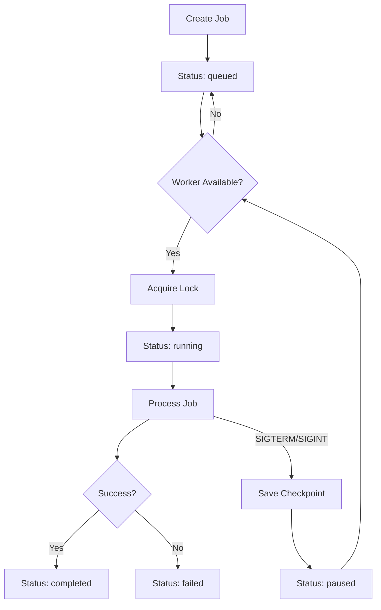

# Hệ Thống Hàng Đợi (Queue System)

## Tổng Quan

Hệ thống hàng đợi cho phép quản lý các job alpha generation theo cơ chế FIFO (First In First Out). Chỉ có **1 job chạy tại một thời điểm**, các job khác sẽ đợi trong hàng đợi.

### Tính Năng Chính

- ✅ **FIFO Queue**: Chỉ 1 job chạy, các job khác đợi theo thứ tự
- ✅ **Checkpoint & Resume**: Lưu trạng thái khi tắt, tiếp tục khi khởi động lại
- ✅ **Alpha Tracking**: Hiển thị alpha ID đang được xử lý thay vì PID
- ✅ **Progress Tracking**: Theo dõi tiến độ chi tiết (stage, alpha processed, approved, submitted)
- ✅ **Auto Submit**: Tự động submit alpha khi hoàn thành
- ✅ **Graceful Shutdown**: Lưu checkpoint khi nhận SIGTERM/SIGINT

## Kiến Trúc

```
runtime/
├── job_queue/              # Thư mục chứa queue data
│   ├── active.lock         # Lock file cho job đang chạy
│   ├── jobs/               # Thư mục chứa job definitions
│   │   └── *.json          # Job files
│   └── checkpoints/        # Thư mục chứa checkpoints
│       └── *.json          # Checkpoint files
├── queue_manager.py        # Queue manager
├── queue_worker.py         # Queue worker
└── tracked_pipeline.py     # Pipeline wrapper với tracking
```

## Cách Sử Dụng

### 1. Khởi Động Worker

Worker sẽ tự động xử lý các job trong hàng đợi:

```bash
# Sử dụng CLI tool
python scripts/queue_manager_cli.py start-worker

# Hoặc sử dụng main.py
python main.py --queue-worker

# Với custom poll interval
python main.py --queue-worker --poll-interval 3.0
```

Worker sẽ:
- Tự động lấy job tiếp theo từ hàng đợi
- Chạy job (pipeline, bruteforce, continuous, studio)
- Cập nhật trạng thái real-time
- Lưu checkpoint khi nhận signal
- Resume job từ checkpoint khi khởi động lại

### 2. Thêm Job Vào Hàng Đợi

#### Sử dụng CLI Tool

```bash
# Thêm pipeline job
python scripts/queue_manager_cli.py add-job \
  --type pipeline \
  --strategy momentum \
  --count 5

# Thêm bruteforce job
python scripts/queue_manager_cli.py add-job \
  --type bruteforce \
  --strategy mean-reversion \
  --count 10 \
  --no-submit

# Thêm continuous job (chạy liên tục)
python scripts/queue_manager_cli.py add-job \
  --type continuous \
  --strategy momentum \
  --count 8

# Dry run mode
python scripts/queue_manager_cli.py add-job \
  --type pipeline \
  --strategy momentum \
  --count 3 \
  --dry-run
```

#### Sử dụng main.py

```bash
# Thêm job thay vì chạy ngay
python main.py --queue-add --run-once --strategy-type momentum --count 5

# Thêm bruteforce job
python main.py --queue-add --bruteforce --strategy-type momentum --count 10
```

### 3. Xem Trạng Thái Hàng Đợi

```bash
# Sử dụng CLI tool
python scripts/queue_manager_cli.py status

# Hoặc sử dụng main.py
python main.py --queue-status
```

Output mẫu:

```
=== QUEUE STATUS ===

🔄 ACTIVE JOB:
   Job ID: 1234567890_abc123
   Type: pipeline
   Strategy: momentum
   Count: 5
   Stage: simulation
   Current Alpha ID: alpha_run_456
   Current Expression: rank(ts_delta(close, 5) * volume)...
   Progress: tested=2, approved=1
   Alphas Processed: 2
      ✅ alpha_run_455: rank(ts_delta(close, 3))... (approved)
      ❌ alpha_run_456: rank(volume * close)... (tested)
   Stats: approved=1, submitted=0

📋 QUEUED: 2 jobs
   - 1234567891_def456: pipeline momentum (count=8)
   - 1234567892_ghi789: bruteforce mean-reversion (count=10)

⏸️  PAUSED: 0 jobs

✅ COMPLETED: 5 jobs
   - 1234567880_xyz123: pipeline momentum (approved=3, submitted=2)
   - 1234567881_uvw456: pipeline mean-reversion (approved=2, submitted=1)

❌ FAILED: 1 jobs
   - 1234567870_rst789: pipeline momentum - Connection timeout
```

### 4. Cleanup Old Jobs

```bash
# Cleanup jobs cũ hơn 7 ngày
python scripts/queue_manager_cli.py cleanup

# Custom max age (3 ngày)
python scripts/queue_manager_cli.py cleanup --max-age 259200

# Hoặc sử dụng main.py
python main.py --queue-cleanup
```

## Workflow Chi Tiết

### Job Lifecycle



### Alpha Tracking

Mỗi khi pipeline xử lý một alpha, hệ thống sẽ:

1. **Cập nhật current_alpha_id**: ID của alpha đang được xử lý
2. **Cập nhật current_alpha_expression**: Expression của alpha
3. **Cập nhật current_stage**: Stage hiện tại (research, generate, simulate, etc.)
4. **Thêm vào alphas_processed**: Danh sách các alpha đã xử lý
5. **Track approved/submitted**: Đếm số alpha approved và submitted

### Checkpoint & Resume

Khi worker nhận signal SIGTERM hoặc SIGINT:

1. Worker lưu checkpoint với thông tin:
   - Job ID
   - Progress hiện tại
   - Alpha đang xử lý
   - Timestamp

2. Job status chuyển sang "paused"

3. Khi worker khởi động lại:
   - Load checkpoint
   - Resume job từ vị trí đã lưu
   - Tiếp tục xử lý

## API Endpoints (Monitor API)

Hệ thống queue cũng có thể được tích hợp vào Monitor API:

```python
# api_layer/monitor_api.py

@app.get("/api/queue/status")
def get_queue_status():
    """Lấy trạng thái hàng đợi"""
    queue_manager = QueueManager(app_root / "runtime" / "job_queue")
    return queue_manager.get_queue_status()

@app.post("/api/queue/add")
def add_job_to_queue(
    job_type: str,
    strategy_type: str,
    count: int,
    submit_enabled: bool = True,
    dry_run: bool = False,
):
    """Thêm job vào hàng đợi"""
    queue_manager = QueueManager(app_root / "runtime" / "job_queue")
    job = queue_manager.create_job(
        job_type=job_type,
        strategy_type=strategy_type,
        count=count,
        submit_enabled=submit_enabled,
        dry_run=dry_run,
    )
    return {"status": "queued", "job_id": job.job_id}
```

## Best Practices

### 1. Chạy Worker Như Service

Sử dụng systemd (Linux) hoặc Windows Service:

```ini
# /etc/systemd/system/alpha-queue-worker.service
[Unit]
Description=Alpha Queue Worker
After=network.target

[Service]
Type=simple
User=alpha
WorkingDirectory=/path/to/Alpha_Generator
ExecStart=/path/to/python main.py --queue-worker
Restart=always
RestartSec=10

[Install]
WantedBy=multi-user.target
```

### 2. Monitor Logs

```bash
# Tail worker logs
tail -f logs/queue_worker.log

# Grep for errors
grep ERROR logs/queue_worker.log
```

### 3. Graceful Shutdown

```bash
# Send SIGTERM to worker
kill -TERM <worker_pid>

# Worker sẽ:
# 1. Lưu checkpoint
# 2. Release lock
# 3. Exit gracefully
```

### 4. Backup Queue Data

```bash
# Backup job queue
tar -czf queue_backup_$(date +%Y%m%d).tar.gz runtime/job_queue/
```

## Troubleshooting

### Worker không lấy job

**Nguyên nhân**: Lock file bị stale

**Giải pháp**:
```bash
# Xóa lock file
rm runtime/job_queue/active.lock

# Hoặc sử dụng cleanup
python main.py --queue-cleanup
```

### Job bị stuck ở status "running"

**Nguyên nhân**: Worker bị kill mà không lưu checkpoint

**Giải pháp**:
```bash
# Kiểm tra process còn chạy không
ps aux | grep queue-worker

# Nếu không còn, xóa lock
rm runtime/job_queue/active.lock

# Job sẽ tự động được resume
```

### Checkpoint không load được

**Nguyên nhân**: Checkpoint file bị corrupt

**Giải pháp**:
```bash
# Xóa checkpoint
rm runtime/job_queue/checkpoints/<job_id>.json

# Job sẽ chạy lại từ đầu
```

## So Sánh Với Hệ Thống Cũ

| Feature | Old System | New Queue System |
|---------|-----------|------------------|
| Concurrent Jobs | Multiple | 1 at a time (FIFO) |
| State Persistence | No | Yes (checkpoint) |
| Resume After Crash | No | Yes |
| Alpha Tracking | No | Yes (ID + expression) |
| Progress Visibility | Limited | Detailed |
| Graceful Shutdown | No | Yes |
| Job Management | Manual | Automated |

## Tích Hợp Với UI

Frontend có thể poll `/api/queue/status` để hiển thị:

- Job đang chạy
- Alpha đang được xử lý (ID + expression)
- Progress bar
- Số alpha approved/submitted
- Hàng đợi jobs

```typescript
// frontend/src/api.ts
export async function getQueueStatus() {
  const response = await fetch('/api/queue/status');
  return response.json();
}

// Poll every 2 seconds
setInterval(async () => {
  const status = await getQueueStatus();
  updateQueueUI(status);
}, 2000);
```

## Kết Luận

Hệ thống queue mới cung cấp:

- ✅ Quản lý job tốt hơn (FIFO, 1 job at a time)
- ✅ Khả năng phục hồi cao (checkpoint & resume)
- ✅ Visibility tốt hơn (alpha tracking, progress)
- ✅ Tích hợp dễ dàng với UI
- ✅ Production-ready (graceful shutdown, error handling)

Hệ thống này phù hợp cho việc chạy alpha generation 24/7 với khả năng tự động phục hồi khi có sự cố.
